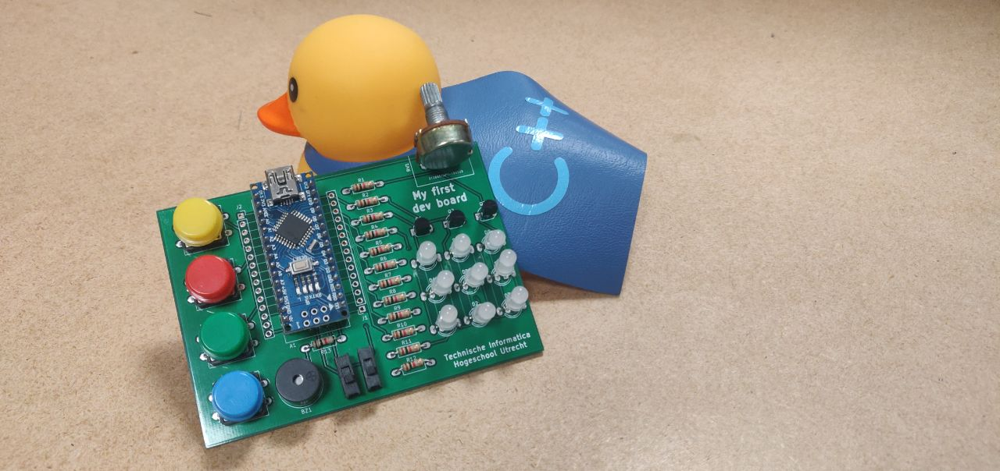

# My first devboard

This devboard is meant to teach computer engineering students of the university of applied sciences to solder and to give them a learning platform to learn embeddded C++. This project is open source and can be found on github: github.com/CvRXX/myFirstDevBoard

## What do you need?
To solder the board you need the following components:

    - The board (I ordered this at jlcpcb.com)
    - 13x 1kΩ resistors
    - 9x RGB LEDS (common annode)
    - 1x arduino nano with pinstrips (optionaly a female strip)
    - 1x passive buzzer
    - 4x push buttons
    - 2x slider switches (2.54mm pin distance)
    - 3x bc550 transistors 
    - 1x 1k pot meter (everything up to 10kΩ)
    - 1x usb cable for the nano
    
## How to solder it?
This readme is not a soldering course so the exact details on how to solder something should be found somewhere else. But I want to give some hints to make your life easier:

    1. Solder the components which are the lowest first (the resistors) and the highest last (the pod meter).
    2. Make sure you put in the leds the right way (long lead in the square hole).
    3. Put headers under the arduino nano so you can use the arduino for others things.
    4. Put the nano with headers on the board and then solder everything in one go.
    
## How to program it?
The one thing that I hate most about of the arduino nano is that they lack a bootloader. The students from Utrecht are lucky beause Florian and I flashed every board already. If you don't have such a nice person nearby you should flash it yourself. This tuturial describes it nicely: https://www.instructables.com/id/How-To-Burn-a-Bootloader-to-Clone-Arduino-Nano-30/.

After that you can use the arduino IDE to flash the board. The students from Utrecht are required to use bmptk & hwlib. 

To find out what is connected to what please read the schematic that's included. You can open this with the free opensource program called kicad (http://kicad-pcb.org/).

## I still run into problems, what now?
If you are a student from Utrecht you can go into the turing lab and ask Carlos, Florian or Wouter. If Utrecht is a bit far away from you feel free to email me : myfirstdevboard {at} carlosvanrooijen.nl

## I'm a teacher at an university and I really want to use this, can I?
Sure, love to see my board being used in other places. The only thing that I ask of you is that you retain my name on the board and send me an email that you use it. I only ask for the email because it makes me happy to know that others use it.
